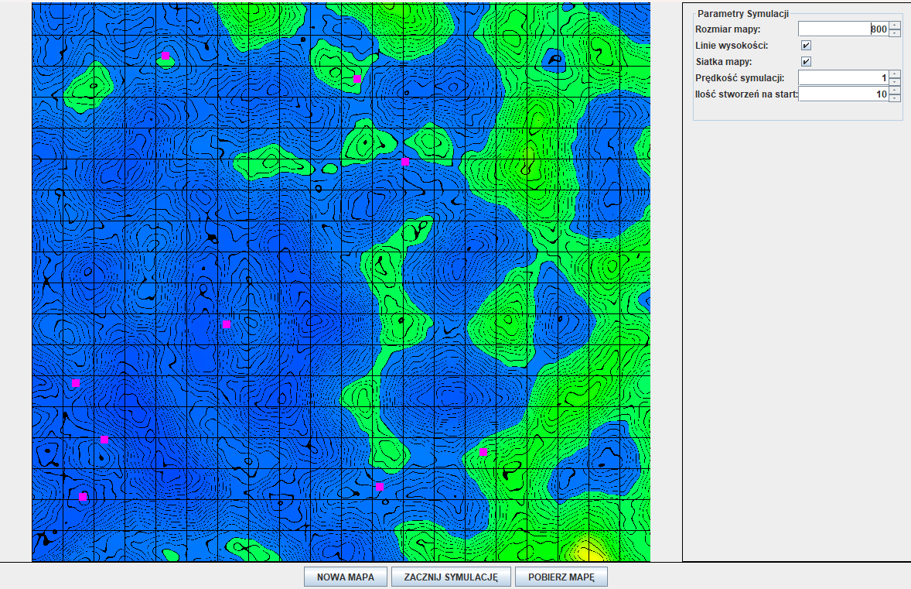
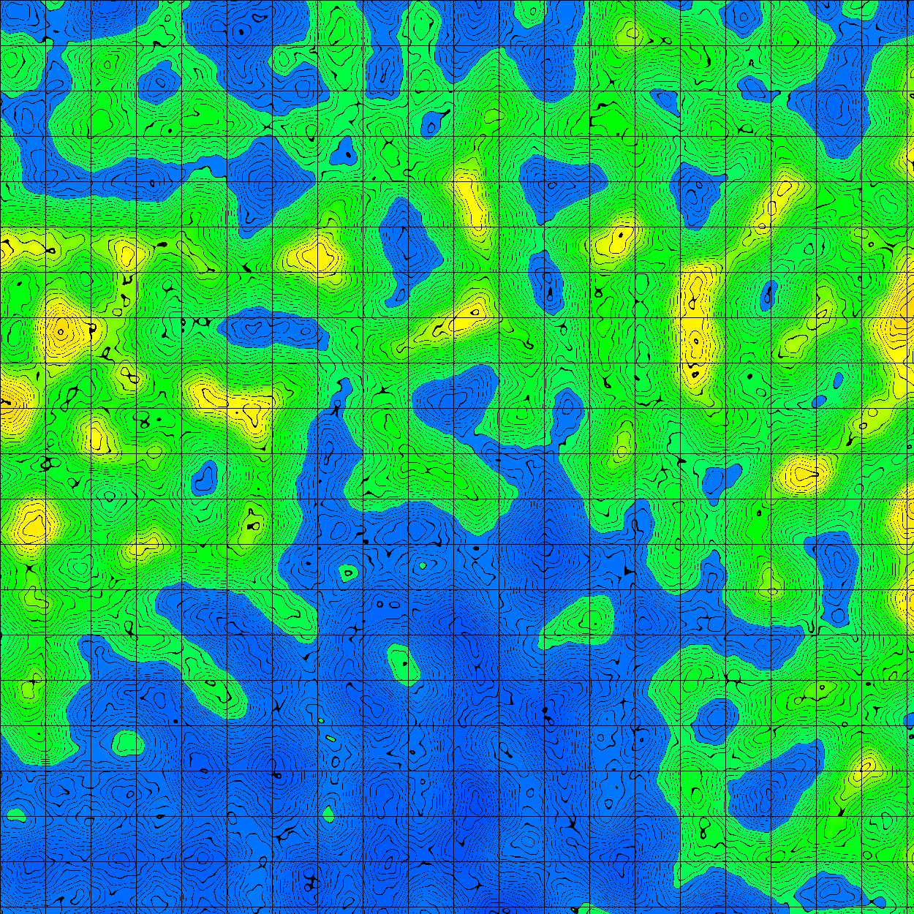
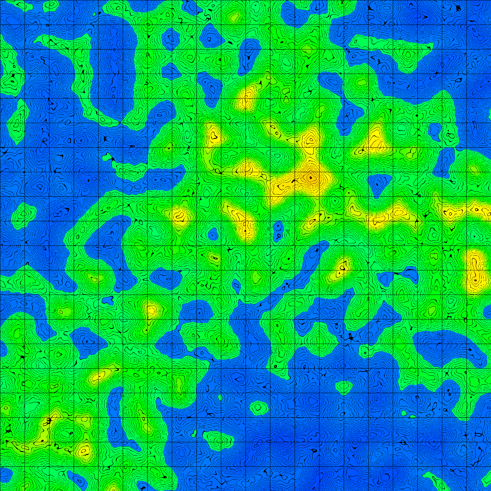
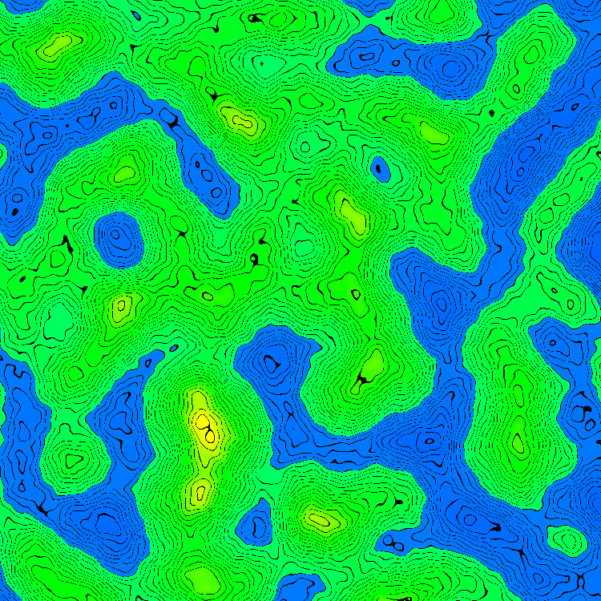

# Perlin Noise Map Simulator 🌍

A Java application for generating procedural terrain maps using Perlin noise and simulating creature behavior. Built with Swing GUI and real-time controls.



## Features ✨

- **Dynamic Map Generation**
  - 4-layer Perlin noise for realistic terrain
  - Biome detection (Water, Grassland, Mountains)
  - Toggleable altitude contours and grid lines
- **Creature Simulation** 👾
  - Random movement patterns
  - Customizable population size
  - Speed-adjusted simulation thread
- **Interactive GUI** 🖱️
  - Pan & zoom functionality
  - Parameter adjustments
  - Map export to PNG
- **Customization Options** ⚙️
  - Adjustable map size (100-2000px)
  - Simulation speed control (1x-10x)
  - Creature count management

## Installation 🛠️

**Requirements:**  
Java JDK 17+\
Gradle

1. Clone repository:

```bash
git clone https://github.com/pswierzy/JavaProjektMapa
```

2. Go into project directory:

```bash
cd JavaProjektMapa/WorldMap
```

3. Build and run the app using Gradle:

```bash
./gradlew run
```

## Usage 🕹️

### 🖱️ Mouse Controls

- **Pan View**: Click & drag with left mouse button
- **Zoom**: Scroll up/down with mouse wheel
- **Dynamic Zoom Center**: Zoom adjusts relative to cursor position

### 🎮 Button Panel

| Button               | Action                                       |
| -------------------- | -------------------------------------------- |
| **NEW MAP**          | Generates new terrain with current settings  |
| **START SIMULATION** | Starts creature movement simulation          |
| **STOP SIMULATION**  | Pauses simulation (text changes dynamically) |
| **DOWNLOAD MAP**     | Saves current map as PNG (opens file dialog) |

## **Example maps**

\
\

